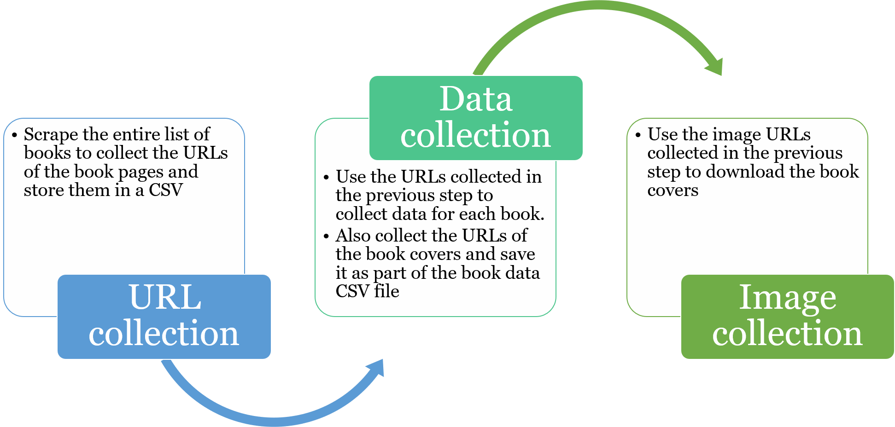
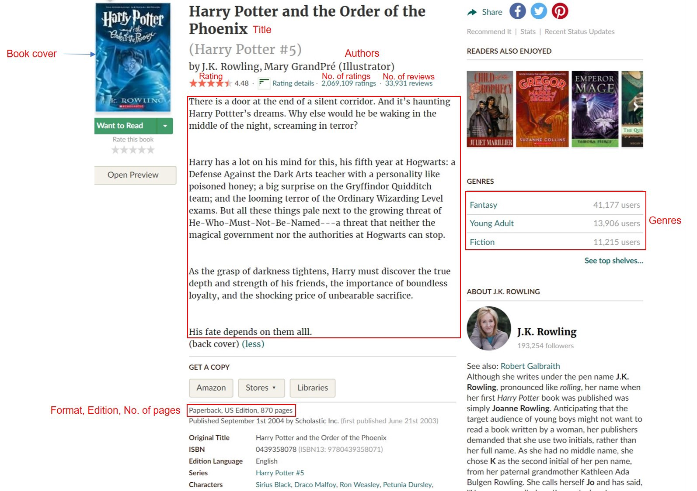

## Data Collection - Web scraping

------------------

#### Description
This is first step in data science project flow. I use list of best books ever from [Goodreads](goodreads.com) as the source of
dataset. The work for this chunk includes 3 steps:
 - 1st, we need to collect all the each individual book link from [list of best books ever](https://www.goodreads.com/list/show/1.Best_Books_Ever)
 - 2nd, from the list books url, we loop over and enter each specific link to collect the book data. Specially, the book image
    should not be collect at this time with other properties. We only save all the image book links for downloading later.
 - 3rd, from list image book urls saved before, we are going to download all the image through list.

#### Appendix:

Image Data Information:
    - Title
    - Description
    - Authors
    - Edition
    - Format
    - ISBN
    - No. of pages
    - Rating
    - No. of ratings
    - No. of reviews
    - Genres
    - Book cover images

